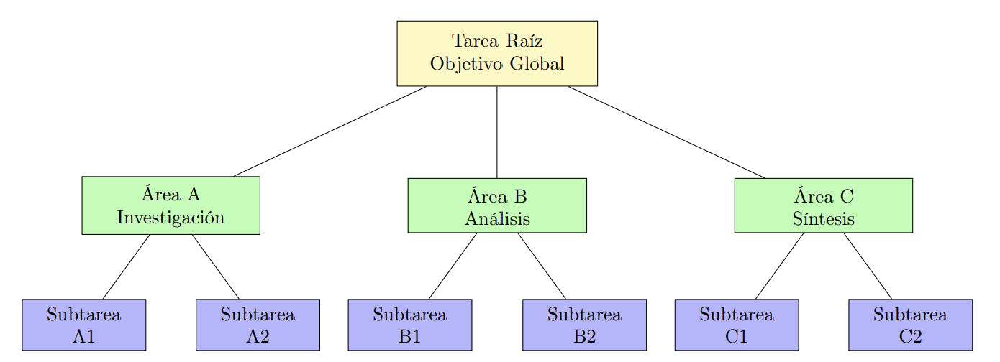

# StratMind

Dynamic LLM-Based Architecture for Autonomous Task Decomposition and Hierarchical Intelligent Agent Generation

**StratMind** is a multi-agent system powered by LLMs (Large Language Models) for autonomously decomposing, refining, and executing complex tasks, generating structured task trees and results. The workflow covers everything from interactive task specification to execution and export of the full task tree.

> ⚠️ This is a public overview. The full implementation is private and under academic and intellectual property protection.  
> For collaboration or demo access, please contact the author directly.

---


## Main Features

- **Interactive Specification:** Clarify and detail tasks through a dialogue with a specialized agent.
- **Automatic Synthesis:** Summarize and formalize the clarified task and expected output.
- **Intelligent Decomposition:** Break down tasks into specialized functional areas using LLM agents.
- **Subtask Planning:** Generate concrete subtasks for each area, resolving dependencies and avoiding duplication.
- **Recursive Refinement:** Automatically refine ambiguous subtasks until they are executable.
- **Autonomous Execution:** Execute each subtask (via LLM or simulation), propagating results through the tree.
- **Structured Export:** Export the complete tree in JSON and TXT, ready for analysis or integration.
- **API and CLI:** Use interactively via CLI or integrate with other systems via a FastAPI backend.

---

## System wowrkflow


## Example Workflow

1. **Specification:**  
   The user describes the task and answers clarification questions.
2. **Synthesis:**  
   The system summarizes the task and expected output.
3. **Decomposition:**  
   The agent splits the task into functional areas.
4. **Planning:**  
   Each area generates concrete subtasks, resolving dependencies.
5. **Refinement:**  
   Ambiguous subtasks are recursively refined.
6. **Execution:**  
   Each subtask is executed (via LLM or simulation).
7. **Export:**  
   The task tree and results are exported in JSON and TXT.


## Hierarchical Task Tree



A global objective is decomposed into functional areas and concrete subtasks in a tree structure. Each node represents a meaningful unit of work handled by a specialized agent.

## Logical Dependencies


The system tracks parent-child relationships and also captures cross-subtask dependencies, ensuring execution order and data flow integrity.


## Evaluation & Analysis

StratMind includes a suite of evaluation tools to assess performance, robustness, and consistency across generated task trees and agent behaviors.

### Notebooks

| File | Purpose |
|------|---------|
| `evaluation/analysis/quality_analysis.ipynb` | Analyzes output task trees for structure, depth, and quality metrics. |
| `evaluation/analysis/robustness_analysis.ipynb` | Evaluates system consistency across input variations to assess robustness. |


## Project Structure

```
src/
  agents/           # LLM agents: specify, synthesize, decompose, specialist, refiner, executor
  utils/            # Task classes, exporters, serialization and prompt utilities
  prompts/          # Plain text prompts for each agent (editable for custom behavior)
  executor/         # Subtask execution logic
  APErefiner/       # Advanced iterative refiner (experimental)
main.py             # Interactive CLI runner
back.py             # FastAPI backend for web/API integration
output/             # Exported task trees (JSON/TXT)
requirements.txt    # Python dependencies
```

---

## 🔒 Why This Repository Is Limited

This public repository contains:
- Conceptual overview of StratMind
- Architectural diagrams and flow visualizations
- High-level examples of system behavior

It **does not include code or implementation logic**, which remains part of an active research and development process under academic protection.


## Contact

If you are interested in learning more, collaborating, or requesting access for research purposes, please get in touch:

- **Authors:** Nicolás Ramírez  - Jorge Martín
- **Institution:** Universidad de Navarra – Master in Big Data Science & AI  
- **Email:** nicolasramirez0423@gmail.com  
- **GitHub:** [@nicolasramirezg](https://github.com/nicolasramirezg)

---

## Installation

1. **Clone the repository:**
   ```bash
   git clone <REPO_URL>
   cd agentLLM
   ```

2. **Install dependencies:**
   ```bash
   pip install -r requirements.txt
   ```

3. **Set your OpenAI API Key:**
   - Create a `.env` file in the root directory with:
     ```
     OPENAI_API_KEY=your_key_here
     ```

---

## Usage

### Interactive Mode (CLI)

```bash
python main.py
```
- The system will guide you to specify, decompose, refine, and execute all subtasks.
- At the end, it exports the task tree to the `output/` directory.

### API Mode (FastAPI)

```bash
uvicorn back:app --reload
```
- Exposes endpoints for each pipeline stage (`/clarify`, `/synthesize`, `/decompose`, `/plan_subtasks`, `/refine`, `/execute`, etc.).
- Ideal for integration with web frontends or automation.
- Session-based: Each session tracks its own task tree and progress.

---

## Credits

Developed by Nicolás Ramírez & Jorge Martin  
Universidad de Navarra  
Master in Big Data Science & AI

All rights reserved
No reuse or redistribution is permitted without explicit consent from the author.

## License

**All rights reserved.**

This repository is shared for academic and informational purposes only.  
**No reuse, reproduction, or redistribution of the content is permitted** without **explicit written consent** from the author.